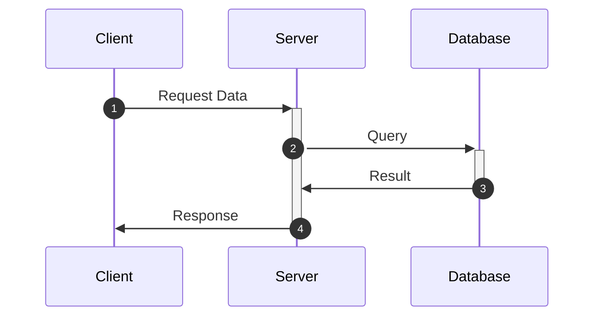

# Periscope

一个用于调试时打桩的 C++ 模板库，可以在程序运行时自动生成 Mermaid 图表，可视化对象间的交互关系。

## 快速开始

### 示例 1：独立绘图（使用 int 作为 key）

也可以作为独立的绘图程序使用，不依赖业务代码：

```cpp
#include "periscope.h"
#include "periscope_link.h"
#include "periscope_node.h"
#include <iostream>

int main() {
    int key = 1;
    auto& graph = PSCP_SEQUENCE(key);
    graph.config().Show_sequenece_number = true;
    
    using node_t = periscope::node<int>;
    using link_t = periscope::binary_link<int>;
    
    // 创建参与者
    auto& client = graph.add_node<node_t>().set_note("Client");
    auto& server = graph.add_node<node_t>().set_note("Server");
    auto& database = graph.add_node<node_t>().set_note("Database");
    
    // 创建交互
    graph.add_link<link_t>(client, server).set_note("Request Data");
    graph.add_link<link_t>(server, database).set_note("Query");
    graph.add_link<link_t>(database, server).set_note("Result");
    graph.add_link<link_t>(server, client).set_note("Response");
    
    // 导出为 Markdown
    PSCP_CTX().gs_export_type = periscope::export_type::k_mark_down;
    std::cout << periscope::format_printer::print("[0]", graph) << std::endl;
    
    return 0;
}
```

### 示例 2：调试时打桩记录交互

在需要调试的地方插入简单的代码，即可自动记录并可视化对象间的交互：

```cpp
#include "periscope.h"
#include "periscope_key.h"
#include "periscope_link.h"
#include "periscope_node.h"
#include <iostream>

class Service {
    std::string name;
    
public:
    Service(const std::string& n) : name(n) {}
    
    void send_request(Service* target, const std::string& msg) {
        // 调试打桩：记录对象交互
        auto& graph = PSCP_SEQUENCE(this);
        using node_t = periscope::node<PSCP_KEY_T(this)>;
        using link_t = periscope::binary_link<PSCP_KEY_T(this)>;
        
        if (!graph.exists(this)) {
            graph.add_node_at<node_t>(this).set_note(name);
        }
        if (!graph.exists(target)) {
            graph.add_node_at<node_t>(target).set_note(target->name);
        }
        
        graph.add_link<link_t>(this, target).set_note(msg);
        
        // 原有的业务逻辑...
    }
};

int main() {
    Service client("Client");
    Service server("Server");
    Service database("Database");
    
    // 业务逻辑
    client.send_request(&server, "Request Data");
    server.send_request(&database, "Query");
    database.send_request(&server, "Result");
    server.send_request(&client, "Response");
    
    // 导出为 Markdown
    PSCP_CTX().gs_export_type = periscope::export_type::k_mark_down;
    auto& graph = PSCP_SEQUENCE(&client);
    graph.config().Show_sequenece_number = true;
    std::cout << periscope::format_printer::print("[0]", graph) << std::endl;
    
    return 0;
}
```

### 运行结果

示例 1 会生成以下序列图：



示例 2 会生成以下序列图（实际运行时的对象地址会不同）：


