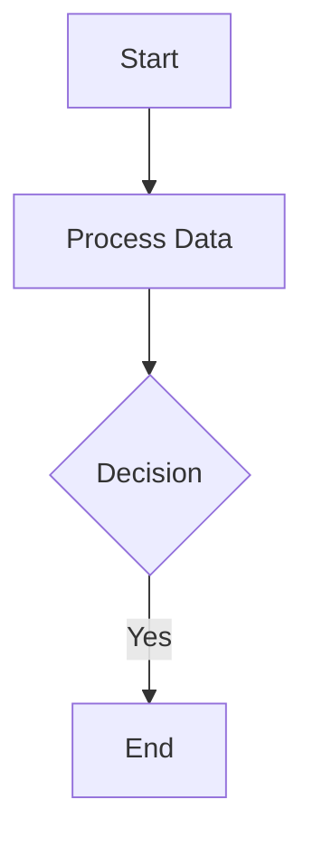
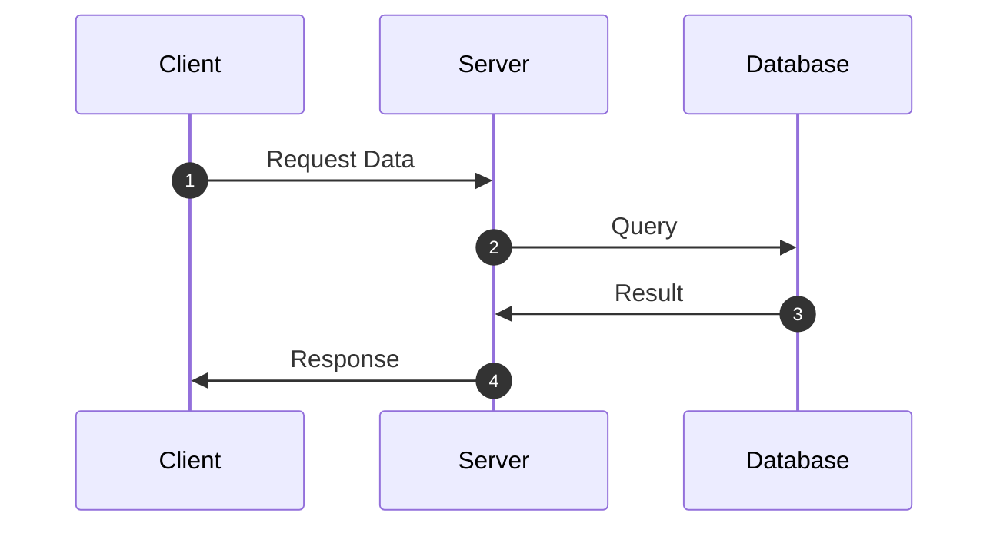
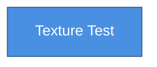
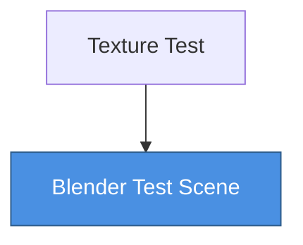
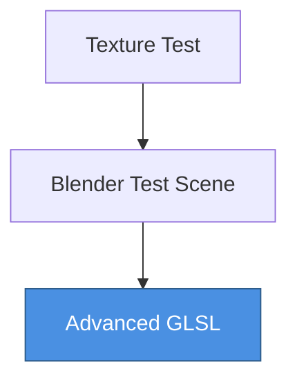
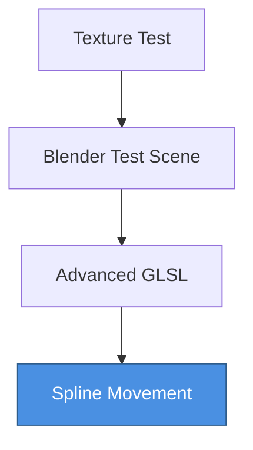

# Periscope

A C++ template library for generating Mermaid diagrams, supporting flowcharts and sequence diagrams.

## Example 1: Flowchart (using int as handle)

Create a flowchart directly using the API with `int` as the handle type:

```cpp
#include "periscope.h"
#include <iostream>

int main() {
    using namespace periscope;
    
    graph<int> _graph;
    
    // Create nodes
    node& start = _graph.new_object<node>();
    start.set<OP_name>("Start").set<NP_shape>(NP_shape::k_rectangle);
    
    node& process = _graph.new_object<node>();
    process.set<OP_name>("Process Data").set<NP_shape>(NP_shape::k_rectangle);
    
    node& decision = _graph.new_object<node>();
    decision.set<OP_name>("Decision").set<NP_shape>(NP_shape::k_diamond);
    
    node& end = _graph.new_object<node>();
    end.set<OP_name>("End").set<NP_shape>(NP_shape::k_rectangle);
    
    // Create links
    link& link1 = _graph.new_object<link>();
    link1.set<LP_source>(start)
         .set<LP_target>(process)
         .set<LP_style>(LP_style::k_solid | LP_style::k_arrow_mask);
    
    link& link2 = _graph.new_object<link>();
    link2.set<LP_source>(process)
         .set<LP_target>(decision)
         .set<LP_style>(LP_style::k_solid | LP_style::k_arrow_mask);
    
    link& link3 = _graph.new_object<link>();
    link3.set<LP_source>(decision)
         .set<LP_target>(end)
         .set<LP_style>(LP_style::k_solid | LP_style::k_arrow_mask)
         .set<OP_name>("Yes");
    
    // Configure graph
    _graph.template set<GP_type>(graph_type::k_flowchart)
          .template set<GP_output_format>(graph_output_format::k_markdown)
          .template set<GP_flowchart_direction>(GP_flowchart_direction<int>::k_top_to_down);
    std::cout << _graph.to_string() << std::endl;
    return 0;
}
```

**Output:**



## Example 2: Sequence Diagram (using pointer as handle, simulating runtime hooks)

Hook object interactions during program execution, using object pointers as handles:

```cpp
#include "periscope.h"
#include <iostream>
#include <map>

class Service {
public:
    std::string name;
    Service(const std::string& n) : name(n) {}
    
    static graph<const void*>& get_hook_graph() {
        static graph<const void*> hook_graph;
        return hook_graph;
    }
    
    void send_request(Service* target, const std::string& msg) {
        auto& hook_graph = get_hook_graph();
        static std::map<const void*, bool> registered;
        
        handle<const void*> this_handle(reinterpret_cast<const void*>(this));
        handle<const void*> target_handle(reinterpret_cast<const void*>(target));
        
        if (!registered[this]) {
            hook_graph.new_object_at<node>(this_handle).set<OP_name>(name);
            registered[this] = true;
        }
        if (!registered[target]) {
            hook_graph.new_object_at<node>(target_handle).set<OP_name>(target->name);
            registered[target] = true;
        }
        
        link& req = hook_graph.new_object<link>();
        auto src_handle = hook_graph.access<node>(this_handle).get_handle();
        auto dst_handle = hook_graph.access<node>(target_handle).get_handle();
        req.set<LP_source>(src_handle).set<LP_target>(dst_handle).set<OP_name>(msg);
    }
    
    static void print_graph() {
        auto& hook_graph = get_hook_graph();
        hook_graph.template set<GP_type>(graph_type::k_sequence)
                  .template set<GP_output_format>(graph_output_format::k_markdown)
                  .template set<GP_sequence_show_number>(true);
        std::cout << hook_graph.to_string() << std::endl;
    }
};

int main() {
    Service client("Client");
    Service server("Server");
    Service database("Database");
    
    // Business logic triggers hooks
    client.send_request(&server, "Request Data");
    server.send_request(&database, "Query");
    database.send_request(&server, "Result");
    server.send_request(&client, "Response");
    
    // Output sequence diagram
    Service::print_graph();
    return 0;
}
```

**Output:**



## Example 3: Take snapshots to illustrate active test switching.



--------------- Next graph -----------------


--------------- Next graph -----------------


--------------- Next graph -----------------

